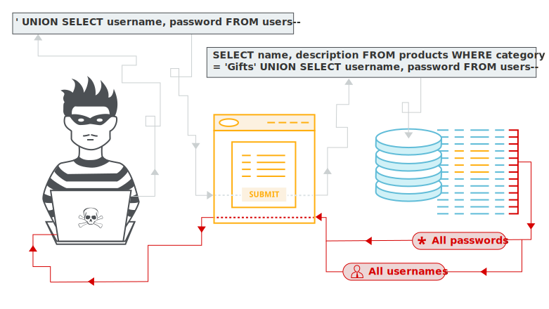

# SQL Injection

### O que é?

SQL Injection é uma vulnerabilidade de aplicações web que permite a manipulação das queries sql que serão feitas diretamente no banco de dados através da aplicação. A exploração desta vulnerabilidade pode permitir o acesso a dados sensíveis da aplicação, como dados de acesso e informações dos usuários.




### Requisitos

É importante saber como realizar as operações básicas de sql e como funciona o protocolo Http e seus métodos de requisição e 

[Requisições Http - MDN Web Docs](https://developer.mozilla.org/pt-BR/docs/Web/HTTP/Methods)

[SQL Para Iniciantes - DevMedia](https://www.devmedia.com.br/sql-select-guia-para-iniciantes/29530)


- Consulta SQL

> Exemplo de consulta de todas as colunas da tabela produto que o id_produto seja igual ao id passado pela aplicação:

```
SELECT * FROM produtos WHERE id_produto = ${id}
```

- Requisição da Aplicação

> Exemplo da requisição feita pela aplicação buscando somente o produto que tenha id = 10:

```
https://www.meusiteficticio.com.br/produtos.php?id=10
```
<br>

### Exemplos

#### Dados Ocultos

```
 ' OR 1 = 1 --
```

 Inserindo este comando sql no final da url "https://www.meusiteficticio.com.br/produtos.php?id=10" estaríamos concatenando a query que está pronta na aplicação. O resultado seria este:

```
SELECT * FROM produtos WHERE id_produto = ${id} OR 1 = 1
```

Desta forma teríamos acesso a detalhes de produtos que não estão disponíveis na aplicação.

