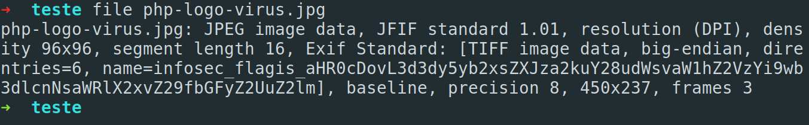

# Level 11

url: http://ctf.infosecinstitute.com/leveleleven.php

## English Version 

### Resolution

The message is : "What another sound again??? No it must not be a sound? But wait whaT?" This time there is a new image... So let's download that with wget and inspect with file :



There is a atribute name with content:

```
name=infosec_flagis_aHR0cDovL3d3dy5yb2xsZXJza2kuY28udWsvaW1hZ2VzYi9wb3dlcnNsaWRlX2xvZ29fbGFyZ2UuZ2lm
```
The last part of the name maybe is base64 so let's decode

```
base64 -d myFile > outputFile
```
> The output is "http://www.rollerski.co.uk/imagesb/powerslide_logo_large.gif"

In this new url we have a gif with our flag...


### Flag

```
infosec_flagis_powerslide
```

## Versão em Português

### Resolução

A mensagem que recebemos é: "What another sound again??? No it must not be a sound? But wait whaT?" Desta vez temos uma nova imagem... Então vamos fazer o download dela e inspecionar com o fiel:


Existe um atributo name contendo:

```
name=infosec_flagis_aHR0cDovL3d3dy5yb2xsZXJza2kuY28udWsvaW1hZ2VzYi9wb3dlcnNsaWRlX2xvZ29fbGFyZ2UuZ2lm
```
A última parte do name parece ser um base64 então vamos fazer o decode...

```
base64 -d myFile > outputFile
```
> A saída é "http://www.rollerski.co.uk/imagesb/powerslide_logo_large.gif"

Nesta nova url temos um gif que é a nossa flag...


### Flag

```
infosec_flagis_powerslide
```