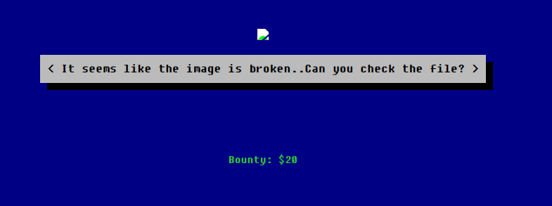
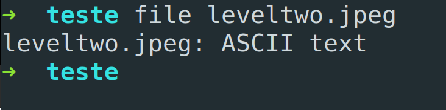

# Level 2

url: http://ctf.infosecinstitute.com/leveltwo.php


## English Version 

### Resolution

When entering to the site we can see a page like that:



The text says "It seems like the image is broken... Can you check the file?". So its a good idea check the html source more specifically the img tag...

```

```

So we can get the path in the src where the jpeg is saved and with the wget we can download this file to examine.

In a terminal:

```
wget http://ctf.infosecinstitute.com/img/leveltwo.jpeg
```

Examining:

```
file leveltwo.jpeg
```



Inside the file there is a text "aW5mb3NlY19mbGFnaXNfd2VhcmVqdXN0c3RhcnRpbmc=" that we can see is a base64. The flag is the text decoded.

Decoding:

```
base64 -d leveltwo.jpeg > outputFile
```

### Flag

```
infosec_flagis_wearejuststarting
```

## Versão em Português

### Resolução

Ao entrar no site será possível ver uma página como esta:


O texto diz: "Parece que a imagem está quebrada... Você pode checar o arquivo?". Então é uma boa ideia verificar o código html mais especificamente a tag img...

```

```

Então podemos pegar o caminho que está o arquivo jpeg e com o wget podemos fazer o download do arquivo e examiná-lo.

No terminal:

```
wget http://ctf.infosecinstitute.com/img/leveltwo.jpeg
```

Examinando:

```
file leveltwo.jpeg
```


Dentro do arquivo existe um texto: "aW5mb3NlY19mbGFnaXNfd2VhcmVqdXN0c3RhcnRpbmc=" que podemos observar que se trata de um base64. A flag está no decode deste texto.

Decoding:

```
base64 -d leveltwo.jpeg > outputFile
```

### Flag

```
infosec_flagis_wearejuststarting
```
