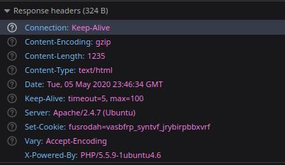

# Level 4

url: http://ctf.infosecinstitute.com/levelfour.php

## English Version 

### Resolution

When entering to the site we can see a message "HTTP means Hypertext Transfer Protocol ". So let's see the request for the url:




> There is a Set-Cookie parameter looks like strange. Is a ROT13...


```
fusrodah=vasbfrp_syntvf_jrybirpbbxvrf
```

You can decode this with a simple search in google and we have our flag. 

### Flag

```
infosec_flagis_welovecookies
```

## Versão em Português

### Resolução

Ao entrar no site podemos ver a mensagem "HTTP means Hypertext Transfer Protocol ". Então vamos ver a requisição para a url:


> Tem um parametro Set-Cookie que parece estranho. É um ROT13...


```
fusrodah=vasbfrp_syntvf_jrybirpbbxvrf
```

É possível fazer o decode deste texto com uma simples procura pelo google então temos a nossa flag. 

### Flag

```
infosec_flagis_welovecookies
```