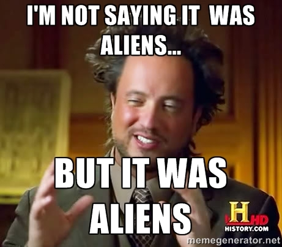

# Level 5

url: http://ctf.infosecinstitute.com/levelfive.php

## English Version 

### Resolution

When entering to the site we receive an infinity loop of alerts. So to analyze the html code i did a curl in the url and found a img tag:

```

```

Going to the img path we can see the img:




How i can't find nothing strange in the website just download the image and used the steghide to examining the file


```
steghide --extract -sf aliens.jpg -xf outputFile
```

There is a binary hidden in this file.

```
01101001011011100110011001101111011100110110010101100011010111110110011001101100011000010110011101101001011100110101111101110011011101000110010101100111011000010110110001101001011001010110111001110011
```

Decode this binary so we get the flag.

### Flag

```
infosec_flagis_stegaliens
```

## Versão em Português

### Resolução

Ao entrar no site vvocê vai receber um loop infito de alertas. Para analisar o html eu dei um curl e achei uma tag img:

```

```

Indo até o caminho da imagem foi possível vê-la:


Como não tinha nada de estranho no site fiz o download e usei o steghide para examinar o arquivo:


```
steghide --extract -sf aliens.jpg -xf outputFile
```

Existe um binário escondido no arquivo:

```
01101001011011100110011001101111011100110110010101100011010111110110011001101100011000010110011101101001011100110101111101110011011101000110010101100111011000010110110001101001011001010110111001110011
```

Ao decifrar o binary para ASCII teremos a nossa flag.

### Flag

```
infosec_flagis_stegaliens
```