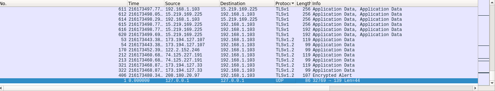
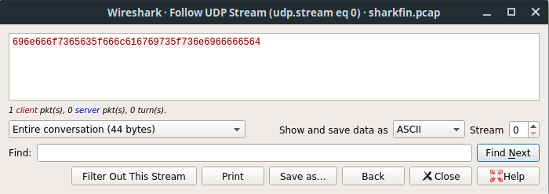

# Level 6

url: http://ctf.infosecinstitute.com/levelsix.php

## English Version 

### Resolution

When entering to the site there is a message "Do you want to download sharkfin.pcap file?". This extension is about a packet captures. So lets open this file in wireshark. I noticed that is only one traffic with UDP protocol and when i analyze him there is a hex code:





Decoding this hex to ASCII we got the flag.

### Flag

```
infosec_flagis_sniffed
```

## Versão em Português

### Resolução

Ao entrar no site recebemos a mensagem: "Do you want to download sharkfin.pcap file?". Esta extensão é de captura de pacotes. Então vamos abrir este arquivo com o wireshark. Percebi que tem somente um trafego UDP e dentro dele estava o hex:


Decoding este hex para ASCII teremos a flag.

### Flag

```
infosec_flagis_sniffed
```