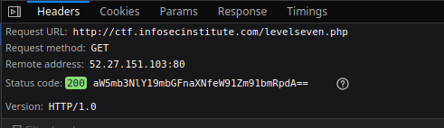

# Level 7

url: http://ctf.infosecinstitute.com/404.php

## English Version 

### Resolution

This url response to us the message: "f00 not found Something is not right here??? btw...bounty $70" and is not the standard url format for the infosecinstitute...

So let's go try put the url in standard format 

```
http://ctf.infosecinstitute.com/levelseven.php
```

The request header have a status code parameter with a base64 code.



There is our flag. 

### Flag

```
infosec_flagis_youfoundit
```

## Versão em Português

### Resolução

A resposta da url nos da a seguinte mensagem: "f00 not found Something is not right here??? btw...bounty $70" e este não é o formato de url que a infosecinstitute vem usando...

Então vamos tentar colocar a url no formato deles.

```
http://ctf.infosecinstitute.com/levelseven.php
```

O header de requisição tem um parametro de status code com um código base64.


Esta é nossa flag.

### Flag

```
infosec_flagis_youfoundit
```